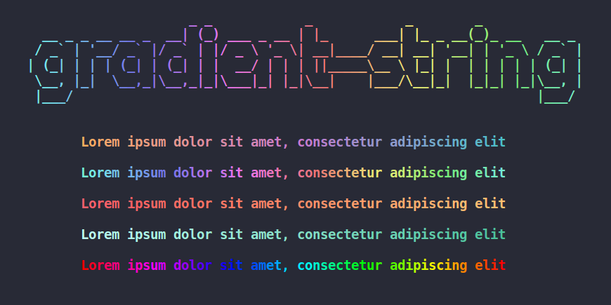

### create project

```bash
mkdir word-game
```

### init project

```bash
cd word-game
npm init -y
```

`package.json` setting

```json
"type": "module"
```

```typescript
// ESM
import foo from "bar";
// CommonJs
const foo = require('bar')
```

### install module 
```bash
 npm i chalk chalk-animation figlet gradient-string inquirer nanospinner
```
### module introduction

1. [chalk](https://github.com/chalk/chalk)

Terminal string styling done right.


2. [chalk-animation](https://github.com/bokub/chalk-animation)

Colorful animations in terminal output.


3. [figlet](https://www.npmjs.com/package/figlet)

This project aims to fully implement the FIGfont spec in JavaScript.

4. [gradient-string](https://www.npmjs.com/package/gradient-string)

Beautiful color gradients in terminal output.



5. [inquirer](https://www.npmjs.com/package/inquirer)

A collection of common interactive command line user interfaces.

6. [nanospinner](https://www.npmjs.com/package/nanospinner)

The simplest and tiniest terminal spinner for Node.js

